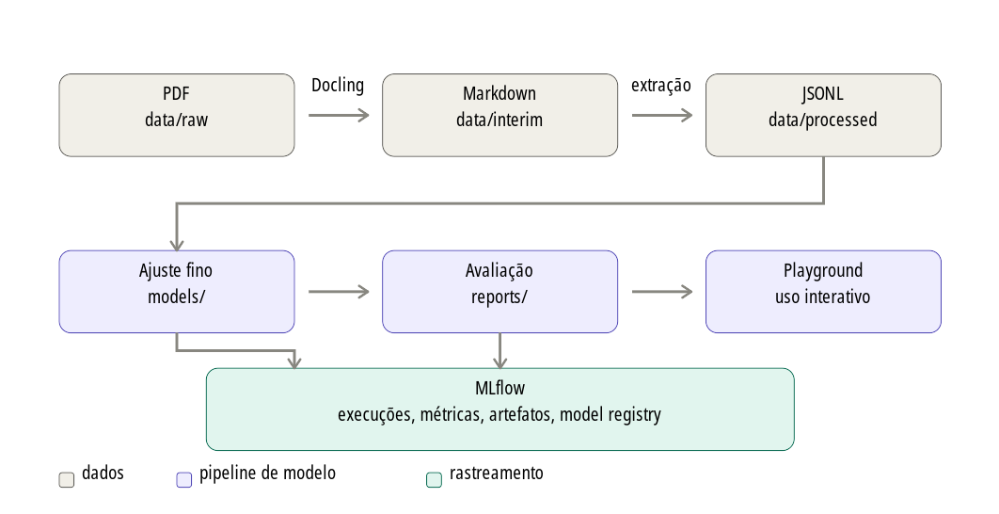

# 🧑‍🌾 Rural - Perguntas e Respostas Generativas

***Coleção 500 Perguntas 500 Respostas da Embrapa - Empresa Brasileira de Pesquisa Agropecuária***

Modelo generativo de perguntas e respostas (*Question Answering - QA*) desenvolvido com **Hugging Face Transformers** a partir da coleção digital **500 Perguntas 500 Resposta da Embrapa - Empresa Brasileira de Pesquisa Agropecuária**, aonde o "produtor pergunta, a Embrapa responde". Vinte temas agropecuários foram selecionados, compreendendo: Abacaxi, Algodão, Arroz, Banana, Caju, Caprinos e Ovinos, Citros, Coco, Feijão-Caupí, Feijão, Gado de Leite, Hortas, Mamão, Mamona, Mandioca, Milho, Produção Orgânica de Hortaliças, Sementes, Sistema de Plantio Direto e Semeadura.

O projeto contempla o ciclo completo (fim-a-fim) de Machine Learning Engineering (MLE): inicialmente converte as publicações da Embrapa do formato PDF original para Markdown com a biblioteca **Docling**; em seguida, extrai os pares de pergunta e resposta; ajusta (*fine-tuning*) de um modelo com vocabulário português e entrega um **playground em Streamlit**
para testar o poder generativo do modelo.

O sistema generativo desenvolvido utiliza-se de duas abordagens: (i) **Encoder-Decoder**, onde o modelo lê o texto e escreve a resposta ou (ii) **Generativo com LLMs (*Large Language Model*) Causais**, visando a construção de assistentes modernos de QA no estilo RAG (*Retrieval-Augmented Generation*) — modelo puramente causal (Decoder-only) de 3B a 8B parâmetros instruídos em português com entrega de respostas mais articuladas e completas.

Para o desenvolvimento do modelo, o ajuste é **escolhido pelo usuário** entre duas arquiteturas bem diferentes (a saber), e o projeto trata as duas de ponta a ponta:

| Chave | Checkpoint | Parâmetros | Arquitetura | Ajuste |
| --- | --- | --- | --- | --- |
| `ptt5` | `unicamp-dl/ptt5-v2-base` | 223M | encoder-decoder (T5) | completo, `float32` |
| `gaia` | `CEIA-UFG/Gemma-3-Gaia-PT-BR-4b-it` | 4,3B | decoder-only (Gemma 3) | LoRA sobre pesos em 4 bits |


O **unicamp-dl/ptt5-v2-base** (Encoder-Decoder) foi desenvolvido pela equipe da Unicamp, o ptt5-v2 traz otimizações no pré-treinamento continuado, estratégias modernas de otimização e versões maiores (até 3B de parâmetros), superando significativamente o ptt5-base antigo em qualidade de geração. Por outro lado, o **CEIA-UFG/Gemma-3-Gaia-PT-BR-4b-it** (Decoder-only) trata-se de um modelo compacto e ajustado especificamente para a língua portuguesa por grupos de pesquisa brasileiros, ideais para inferência local com baixo consumo de memória VRAM.

Segue abaixo a figura da Arquitura da Solução, incluindo o pipeline de Machine Learning (ML):



É importante salientar que todas as etapas do pipeline — extração, partições, treino e avaliação — são executadas sob o **MLflow**, que guarda parâmetros, métricas, linhagem dos dados e artefatos, e recebe o modelo empacotado no Model Registry (ver seção 5).

## 📂 1. Estrutura de Pastas

```
16-hugging-face-transformers/
├── data/
│   ├── raw/               20 publicações da coleção 500 perguntas 500 respostas da Embrapa
│   ├── interim/           Markdown produzido pelo Docling
│   └── processed/         Conjunto de dados final
│       ├── qa_embrapa.jsonl        todos os pares de perguntas e respostas
│       └── splits/                 train.jsonl, validation.jsonl, test.jsonl
├── models/
│   ├── ptt5-qa-embrapa/   T5 ajustado (pesos, tokenizador e checkpoints)
│   └── gaia-qa-embrapa/   Adaptadores LoRA do Gemma (a base vem do Hub)
├── mlflow/                Ciclo de vida dos modelos (MLflow)
│   ├── mlflow.db          Backend SQLite: execuções, métricas e Model Registry
│   └── artifacts/         Artefatos das execuções e modelos empacotados
├── reports/
│   ├── extraction_report.json         Diagnóstico da extração, arquivo a arquivo
│   ├── dataset_report.json            Tamanho e cobertura das partições
│   ├── training_report_<modelo>.json  Hiperparâmetros, perdas e histórico
│   ├── evaluation_report_<modelo>.json Qualidade e originalidade por decodificação
│   ├── generation_samples_<modelo>.md Cenário de execução com exemplos
│   ├── model_comparison.md            Relatório comparativo entre os modelos
│   └── model_comparison.json          Os mesmos dados, em formato estruturado
├── src/app/
│   ├── cli.py             Linha de comando (`qa-embrapa`), orquestra o pipeline
│   ├── config.py          Caminhos, prompt e hiperparâmetros
│   ├── models.py          Catálogo dos modelos selecionáveis e seus padrões
│   ├── topics.py          Normalização dos temas (culturas) da coleção
│   ├── convert.py         Etapa 1 — PDF para Markdown com a biblioteca Docling
│   ├── extract.py         Etapa 2 — Markdown para pares de perguntas e respostas
│   ├── dataset.py         Etapa 3 — Partições e tokenização (seq2seq e causal)
│   ├── train.py           Etapa 4 — Ajuste fino completo ou por LoRA
│   ├── evaluation.py      Etapa 5 — Métricas de qualidade e originalidade
│   ├── comparison.py      Etapa 6 — Comparação entre modelos e recomendação
│   ├── tracking.py        Integração com o MLflow (execuções e artefatos)
│   ├── model_registry.py  Empacotamento pyfunc e Model Registry
│   ├── generate.py        Inferência (usada pela CLI e pelo playground)
│   └── streamlit_app.py   Etapa 7 — Playground
├── tests/                 Testes (dados, treino, MLflow, CLI e playground)
├── Dockerfile             Imagem do playground (dependências + pesos ajustados)
├── docker-compose.yml     Execução em contêiner
├── pyproject.toml         Gerenciamento de dependências e configuração das ferramentas
```

A separação `raw` → `interim` → `processed` segue a convenção do *Cookiecutter Data Science*: cada etapa é reproduzível a partir da anterior e nenhuma delas escreve sobre a entrada da outra.

## ⚙️ 2. Exemplo Completo de Execução (passo a passo)

### 📌 2.1. Pré-requisitos

- Python 3.13 (o arquivo `.python-version` fixa a versão 3.13.9).
- [Poetry](https://python-poetry.org/) 2.x.
- GPU NVIDIA opcional. Sem GPU tudo funciona, apenas o treinamento fica
  bem mais lento.

### 📌 2.2. Instalação

```bash
cd 16-hugging-face-transformers
poetry install
```

Confirme o ambiente:

```bash
poetry run qa-embrapa info
```

```json
{
  "python": "3.13.9",
  "torch": "2.13.0+cu130",
  "cuda_disponivel": true,
  "gpu": "Quadro RTX 4000",
  "pdfs_em_raw": 20,
  "markdown_em_interim": 0,
  "dataset_jsonl": false,
  "particoes": 0,
  "modelo_ajustado": false,
  "mlflow_ativo": true,
  "mlflow_tracking_uri": "sqlite:///.../mlflow/mlflow.db",
  "mlflow_versoes_registradas": 0,
  "mlflow_alias_champion": null
}
```

O mesmo comando, depois do pipeline completo, mostra 20 arquivos Markdown,
8.837 pares extraídos, 3 partições, o modelo ajustado presente e
`"mlflow_alias_champion": "models:/qa-embrapa-ptt5/1"`.

### 📌 2.3. Etapa 1 — Converter os PDFs para Markdown (Docling)

```bash
poetry run qa-embrapa convert
```

Lê os 20 PDFs de `data/raw` e grava um Markdown por tema/cultura em
`data/interim` (`soja.md`, `milho.md`, ...). Leva cerca de **6 minutos**
com GPU. Use `--overwrite` para reconverter e `--cpu` para forçar CPU.

### 📌 2.4. Etapa 2 — Extrair os pares de pergunta e resposta

```bash
poetry run qa-embrapa extract
```

```json
{
  "total": 8837,
  "topics": 20,
  "question_words_mean": 11.3,
  "answer_words_mean": 80.5,
  "answer_words_median": 66,
  "repaired": 574
}
```

Grava `data/processed/qa_embrapa.jsonl` e o diagnóstico em
`reports/extraction_report.json`. Cada registro tem este formato:

```json
{
  "id": "soja-259",
  "topic_slug": "soja",
  "topic": "Soja",
  "number": 259,
  "question": "Quais são os principais cuidados no controle de plantas daninhas em pós-emergência da soja?",
  "answer": "Os principais cuidados são: Escolher os herbicidas apropriados ...",
  "source_pdf": "Soja-o-produtor-pergunta-a-embrapa-responde.pdf",
  "source_markdown": "soja.md",
  "repaired": true
}
```

### 📌 2.5. Etapa 3 — Criar as partições de treino, validação e teste

```bash
poetry run qa-embrapa dataset
```

```json
{
  "train": {"examples": 7511, "topics": 20},
  "validation": {"examples": 884, "topics": 20},
  "test": {"examples": 442, "topics": 19}
}
```

### 📌 2.6. Etapa 4 — Ajustar o modelo

O modelo é escolhido por `--model`. Cada um traz os próprios hiperparâmetros, definidos em `src/app/models.py`; as opções da linha de comando têm precedência sobre eles.

```bash
poetry run qa-embrapa train --model ptt5    # padrão, 223M, ajuste completo
poetry run qa-embrapa train --model gaia    # 4,3B, LoRA sobre pesos em 4 bits
```

| | `ptt5` | `gaia` |
| --- | --- | --- |
| Tempo medido (Quadro RTX 4000, 8 GB) | 32 min | ~3,6 h |
| Épocas | 5 | 1 |
| Lote efetivo | 16 (4 × 4) | 16 (1 × 16) |
| `learning_rate` | 3e-4 | 2e-4 |
| Precisão | `float32` | `bfloat16` |
| Parâmetros treinados | 223M (todos) | 29,8M (0,6%) |
| Saída em `models/` | ~890 MB (pesos completos) | ~120 MB (só adaptadores) |

Os dois cabem nos mesmos 8 GB de VRAM, mas por caminhos opostos: o T5 cabe inteiro, o Gemma só cabe **quantizado em 4 bits**, com adaptadores LoRA como únicos parâmetros treináveis e `gradient_checkpointing` obrigatório. A seção 4.4 detalha as restrições numéricas de cada um.

A perda de validação por época do `ptt5` (registrada em `reports/training_report_ptt5.json`):

| Época | 1 | 2 | 3 | 4 | 5 |
| --- | --- | --- | --- | --- | --- |
| `eval_loss` | 2,835 | 2,759 | 2,725 | 2,708 | 2,704 |

Constatou-se que a curva já está achatada na quinta época, e mais épocas passariam a memorizar as
respostas — o que elevaria o ROUGE e derrubaria a originalidade. Ao final, o comando **registra o modelo no MLflow** e imprime o URI da versão:

```
Modelo ajustado salvo em .../models/ptt5-qa-embrapa
Registrado no MLflow como models:/qa-embrapa-ptt5/1 (alias 'champion')
```

Opções úteis:

```bash
# teste rápido do pipeline (poucos minutos), sem rastrear nem registrar
poetry run qa-embrapa --no-mlflow train --max-train-examples 500 --epochs 1

# treinar e rastrear, mas sem criar uma versão no Model Registry
poetry run qa-embrapa train --no-register

# GPU com pouca memória livre
poetry run qa-embrapa train --batch-size 2 --grad-accum 8 --gradient-checkpointing

# outro checkpoint de origem, em um experimento separado
poetry run qa-embrapa --experiment ptt5-v2 train \
    --base-model unicamp-dl/ptt5-v2-base
```

### 📌 2.7. Etapa 5 — Avaliar a qualidade e originalidade

```bash
poetry run qa-embrapa evaluate --model ptt5 --limit 200
poetry run qa-embrapa evaluate --model gaia --limit 200
```

Gera respostas para o conjunto de teste com quatro decodificações diferentes e grava em `reports/evaluation_report_<modelo>.json`. Use `--limit 0` para o conjunto completo. Os resultados medidos estão na seção 5.

Com o mesmo `--limit`, os dois modelos respondem **exatamente às mesmas perguntas** (os primeiros *N* exemplos da partição de teste, que é fixa e tem semente própria) — é isso que torna as métricas comparáveis.

A avaliação também pode partir do Model Registry em vez do diretório local, o que é o caminho natural para comparar duas versões do mesmo modelo:

```bash
poetry run qa-embrapa evaluate --model-dir "models:/qa-embrapa-ptt5@champion"
poetry run qa-embrapa evaluate --model-dir "models:/qa-embrapa-gaia/1"
```

### 📌 2.8. Etapa 6 — Comparar os modelos

```bash
poetry run qa-embrapa compare
```

Lê os relatórios de avaliação de cada modelo, alinha as métricas e grava em `reports/model_comparison.md` (legível) e `reports/model_comparison.json` (estruturado), com uma recomendação justificada. O critério está descrito na seção 5.

### 📌 2.9. Etapa 7 — Usar o modelo

```bash
# uma pergunta pela linha de comando
poetry run qa-embrapa ask "Como controlar a lagarta-do-cartucho?" --topic Milho

# a mesma pergunta no outro modelo
poetry run qa-embrapa ask "Como controlar a lagarta-do-cartucho?" \
    --topic Milho --model gaia

# resposta mais criativa, com três alternativas
poetry run qa-embrapa ask "Como preparar o solo de uma horta?" \
    --topic Hortas --creative --variants 3

# cenário de demonstração (grava reports/generation_samples_<modelo>.md)
poetry run qa-embrapa samples --model gaia

# playground (o modelo é escolhido na barra lateral)
poetry run qa-embrapa playground
```

O playground esta disponível em <http://localhost:8501>.

### 📌 2.10. Execução do pipeline completo em um comando

```bash
# um modelo só
poetry run qa-embrapa pipeline

# os dois, em sequência, com a comparação ao final
poetry run qa-embrapa pipeline --model ptt5 --model gaia
```

Executa a conversão → extração → partições → treinamento → avaliação → cenário de exemplo, por modelo, e grava a comparação quando há mais de um.

Use `--skip-train` para reaproveitar modelos já ajustados.

### 📌 2.11. Etapa 8 — Inspecionar o ciclo de vida no MLflow

```bash
poetry run qa-embrapa mlflow-ui
```

Abre a interface do MLflow disponível em <http://localhost:5000>, com o histórico de execuções, a comparação entre decodificações e o Model Registry. Para consultar pela linha de comando:

```bash
poetry run qa-embrapa models            # versões registradas e seus aliases
poetry run qa-embrapa promote 2         # aponta o alias champion para a versão 2
```

Qualquer comando pode rodar sem rastreamento com `--no-mlflow`, e o nome do experimento é configurável com `--experiment`:

```bash
poetry run qa-embrapa --no-mlflow train --max-train-examples 200 --epochs 1
poetry run qa-embrapa --experiment ptt5-v2 train --base-model unicamp-dl/ptt5-v2-base
```

### 📌 2.12. Execução em contêiner (Docker)

O playground também roda em contêiner, sem Python nem Poetry na máquina hospedeira. A imagem carrega **todas** as dependências resolvidas pelo Poetry — o `requirements.txt` versionado é a saída de `poetry export --without-hashes`, de modo que as versões são exatamente as do `poetry.lock` — e traz os pesos ajustados junto:

```bash
docker compose up -d --build                 # CPU, http://localhost:8501
docker compose up -d --build playground-gpu  # GPU, http://localhost:8502
docker compose logs -f                       # Acompanhar a inicialização
docker compose down --remove-orphans         # Encerrar
```

Nomear o serviço já habilita o perfil `gpu`. Cada variante tem a sua porta, de modo que `docker compose --profile gpu up`, que sobe as duas de uma vez, não esbarre em conflito.

Sem o Compose:

```bash
docker build -t qa-embrapa-playground:cpu .
docker run --rm -p 8501:8501 qa-embrapa-playground:cpu

docker build -t qa-embrapa-playground:cuda --build-arg TORCH_VARIANT=cuda .
docker run --rm --gpus all -p 8501:8501 qa-embrapa-playground:cuda
```

Nenhum volume é necessário e o contêiner **sobe sem rede** — o que pode ser verificado com `docker run --rm --network none qa-embrapa-playground:cpu`. A mesma imagem serve a linha de comando, útil para conferir o carregamento dos pesos sem abrir o navegador:

```bash
docker compose exec playground qa-embrapa ask --model ptt5 --topic Soja \
    "Qual é a melhor época de semeadura da soja?"
docker compose exec playground-gpu qa-embrapa ask --model gaia --topic Milho \
    "Qual o espaçamento recomendado para o plantio de milho?"
```

**O que entra na imagem** (12,4 GB na variante de CPU, 16,4 GB na de GPU): o ambiente completo de execução, o PTT5 ajustado (853 MB), os adaptadores LoRA do Gaia (146 MB), o checkpoint base do Gemma 3 exigido por eles (8,1 GB), o conjunto processado — que alimenta a resposta de referência e o sorteio de perguntas — e os relatórios das abas *Avaliação* e *Comparação*. Ficam de fora, por meio do `.dockerignore`, os PDFs de origem, os arquivos intermediários, os *checkpoints* do treino (2,7 GB) e o diretório `mlflow/` (3,5 GB).

**Quatro decisões que valem registro:**

*Duas variantes de PyTorch, escolhidas por `TORCH_VARIANT`.* A diferença é grande no modelo de 4B, porque a quantização em 4 bits (NF4, pelo `bitsandbytes`) só é possível com GPU: sem ela, o Gemma carrega em float32 e cada token exige ler 17 GB de pesos da memória. Medido nesta máquina, 32 tokens gerados:

| Variante | Imagem | Gemma, 1 feixe | Gemma, 2 feixes (padrão) | Memória |
| --- | --- | --- | --- | --- |
| `cpu` (padrão) | 12,4 GB | 1,68 tok/s | 0,87 tok/s efetivos | 26 GB de RAM |
| `cuda` (`--gpus all`) | 16,4 GB | 8,81 tok/s | 7,36 tok/s | 3,35 GB de VRAM |

São **5,2× a 8,5×** de diferença: uma resposta de 256 tokens leva ~5 min na variante de CPU e ~35 s na de GPU. O PTT5, com 223M de parâmetros, responde em segundos nas duas. A variante de CPU continua sendo o padrão por rodar em qualquer máquina; a de GPU exige o NVIDIA Container Toolkit no hospedeiro.

Um detalhe descoberto ao testar a variante CUDA: o PyTorch roteia parte das operações por kernels **Triton**, compilados na primeira execução — no Gemma, a codificação rotacional (RoPE) é uma delas. Sem um compilador C na imagem, a geração falha com `Failed to find C compiler` *depois* de carregar os pesos. Por isso a variante `cuda` instala `gcc` e `libc6-dev`; a de CPU não passa por esse caminho e não paga os ~100 MB.

*O checkpoint base do Gemma 3 entra na imagem.* O modelo Gaia entregue pelo treino é um adaptador LoRA de 146 MB e não guarda os pesos base. Eles são gravados no **layout de cache do Hugging Face**, e não em um diretório solto, porque é assim que o `transformers` os encontra pelo nome do repositório informado em `src/app/models.py` — qualquer outro layout exigiria mudar o código da aplicação por causa do empacotamento. O modo offline (`HF_HUB_OFFLINE=1`) é o padrão: sem ele, cada carregamento consultaria o Hub só para conferir a revisão, o que ligaria o contêiner à rede sem necessidade.

*A origem desses pesos é configurável na construção.* Por padrão (`GEMMA_SOURCE=hub`) eles são baixados do Hub durante o build — funciona em qualquer máquina, ao custo de ~8 GB de tráfego e alguns minutos. Quem já tem o checkpoint no cache local evita o download reaproveitando-o como contexto adicional:

```bash
docker build -t qa-embrapa-playground:cpu \
    --build-arg GEMMA_SOURCE=context \
    --build-context hfcache="$HOME/.cache/huggingface" .

# equivalente pelo Compose, descomentando `additional_contexts`:
GEMMA_SOURCE=context docker compose build
```

O rastreamento do MLflow vem desligado no contêiner (`QA_EMBRAPA_NO_MLFLOW=1`), porque o banco em `mlflow/` fica fora da imagem — sem isso, cada carregamento da página tentaria criar um SQLite vazio. Para reativá-lo, descomente o volume `./mlflow` e esvazie a variável no `docker-compose.yml`; a aba *MLflow* e a origem de pesos por Model Registry voltam a funcionar.

## 🛝 3. Sobre o Playground

Interface em Streamlit dividida em cinco abas:

**Playground** — Campo de pergunta, seleção do tema (cultura), botões de perguntas de exemplo e um sorteio de perguntas reais do conjunto. Quando a pergunta digitada consta da coleção, a resposta original da Embrapa é exibida ao lado da gerada, permitindo comparar as duas. O prompt enviado ao
modelo também pode ser inspecionado — e ele muda com a família escolhida: prefixo de tarefa no T5, marcadores de turno no Gemma.

**Controles** (barra lateral):

| Controle | Efeito |
| --- | --- |
| **Modelo pré-treinado** | Alterna entre `ptt5` e `gaia`, recarregando os pesos |
| Origem dos pesos | Diretório local ou versão do Model Registry do MLflow |
| Busca em feixe / Amostragem | Determinístico e fiel × criativo e original |
| Temperatura | Achata ou concentra a distribuição de probabilidade |
| top-p / top-k | Recorta o conjunto de tokens candidatos |
| Número de feixes | Quantas hipóteses a busca mantém em paralelo |
| Penalidade de repetição | Desencoraja repetir trechos já gerados |
| Respostas alternativas | Gera múltiplas respostas para a mesma pergunta |

São dois seletores encadeados, e cada um responde a uma pergunta diferente. O **modelo** escolhe a arquitetura — é o que permite fazer a mesma pergunta ao T5 e ao Gemma e comparar as respostas na mesma tela. A **origem dos pesos** escolhe *qual versão* daquele modelo carregar, do diretório local
ou do Model Registry, e é o que permite comparar duas gerações do mesmo modelo. O limite de feixes acompanha o modelo: 8 no T5, 4 no Gemma, onde cada feixe replica o cache de atenção de um modelo de 4B.

**Avaliação** — métricas do último `evaluate` **do modelo selecionado**, separadas por decodificação.

**Comparação** — o relatório comparativo entre os modelos, renderizado a partir de `reports/model_comparison.md`.

**MLflow** — versões registradas de cada modelo, seus aliases e as execuções que as produziram, com os comandos para abrir a interface e promover versões.

**Sobre o projeto** — descrição do pipeline, dos modelos disponíveis e do significado de cada parâmetro.

## 🖥️ 4. Justificativa das Escolhas Tecnológicas

### 📌 4.1. Docling para a conversão dos PDFs

Os PDFs da coleção são diagramados em duas colunas, com caixas de texto, fotos e cabeçalhos/rodapés de página. Extratores puramente textuais (`pdftotext`, `PyPDF2`) devolvem um fluxo em que a numeração das perguntas se mistura com a numeração das páginas, sem qualquer marcação de estrutura.

A biblitoeca Docling roda um modelo de análise de layout e devolve o documento com **papéis semânticos**: o enunciado de cada pergunta sai como título de seção e os cabeçalhos e rodapés são classificados como mobiliário de página e descartados na exportação para Markdown. É exatamente essa informação que torna a extração determinística:

```markdown
## 147 O que é dormência de sementes?

Dormência é uma condição fisiológica que impede a germinação ...
```

No pipeline, o OCR e a detecção de estrutura de tabelas são desligados (`do_ocr=False`, `do_table_structure=False`): os PDFs já têm texto digital e o conteúdo de interesse é textual — essas duas etapas são as mais caras do pipeline padrão e sua remoção reduz o tempo total de 20 arquivos para ~6 minutos.

### 📌 4.2. Os dois modelos selecionáveis

O projeto utiliza modelos com vocabulário em português; o projeto oferece **dois**, de portes e arquiteturas deliberadamente distintos, para que a escolha seja medida e não presumida. `src/app/models.py` descreve cada um em um `ModelSpec` — checkpoint, família, estratégia de ajuste, caminhos dos artefatos e hiperparâmetros próprios — e todas as etapas recebem essa especificação em vez de testar o nome do checkpoint.

| | `ptt5` | `gaia` |
| --- | --- | --- |
| Checkpoint | `unicamp-dl/ptt5-v2-base` | `CEIA-UFG/Gemma-3-Gaia-PT-BR-4b-it` |
| Parâmetros | 223M | 4,3B (+417M de torre de visão, não usada) |
| Arquitetura | encoder-decoder | decoder-only, multimodal |
| Pré-treino | T5 re-treinado em português (mC4) | Gemma 3 com instrução em pt-BR (CEIA-UFG) |
| Já segue instrução? | não — aprende a tarefa do zero | sim — o ajuste refina domínio e formato |
| Ajuste | completo, 223M parâmetros | LoRA, 29,8M parâmetros (0,6%) |
| Cabe em 8 GB? | sim, em `float32` | só quantizado em 4 bits |

A **família** de cada um atravessa o pipeline inteiro, e é por isso que ela é um conceito de primeira classe no código:

- no *encoder-decoder*, prompt e resposta são sequências separadas — o prompt vai ao codificador, a resposta é o alvo do decodificador;
- no *decoder-only*, os dois formam **uma única** sequência, e o rótulo é essa sequência com o prompt mascarado com `-100`. Sem essa máscara, o modelo gastaria capacidade aprendendo a reproduzir o próprio enunciado. Na geração, é preciso ainda descartar os tokens de entrada da saída e preencher os lotes **à esquerda**, para que todas as sequências comecem a gerar na mesma posição.

### 📌 4.2.1. `unicamp-dl/ptt5-v2-base`

| Critério | Por que este modelo |
| --- | --- |
| Arquitetura | *encoder-decoder* (T5), a família natural para tarefas condicionais de geração de texto: entra a pergunta, sai a resposta. Um modelo apenas decodificador exigiria mais dados para aprender o mesmo mapeamento. |
| Idioma | Pré-treino continuado em português sobre o mC4, com o mesmo vocabulário SentencePiece português do `ptt5` original (os dois tokenizadores são idênticos, 32.100 tokens em comum). O vocabulário do T5 original fragmenta palavras acentuadas em vários tokens, o que encurta o contexto útil e degrada a qualidade em texto técnico em português. |
| Tamanho | 223M parâmetros. Cabe em 8 GB de VRAM para treinamento completo (sem adaptadores) e responde em menos de 1 s por pergunta na inferência, requisito prático para um playground interativo. |
| Geração | é a segunda geração do modelo (`ptt5-base-portuguese-vocab`), descrita em [ptt5-v2: A Closer Look at Continued Pretraining of T5 Models for the Portuguese Language](https://arxiv.org/abs/2406.10806). Como o vocabulário e a arquitetura não mudam, a troca é direta. |

Alternativas consideradas e por que não foram adotadas: **BERTimbau** é apenas codificador, serve para QA extrativo (recortar um trecho do texto), não generativo; **mT5-base** tem vocabulário multilíngue de 250k tokens, o que triplica a matriz de *embeddings* sem ganho para um sistema monolíngue; modelos instruídos de 7B+ não caberiam em 8 GB para ajuste fino completo.

O **`ptt5-v2-large`** (738M parâmetros) foi medido e descartado por não caber na GPU de referência: em `float32`, só os pesos e os gradientes somam 5,5 GB dos ~6,1 GB livres da placa. Nem a combinação de Adafactor (que dispensa os 5,5 GB de estados do AdamW), `gradient_checkpointing` e lote 1 resolve — o pico fica em 5,76 GB, com folga de 0,27 GB, e o `Trainer` estoura a memória em execução real. Reduzir `max_target_length` não altera o pico, que é dominado pelos pesos e gradientes.

### 📌 4.2.2. `CEIA-UFG/Gemma-3-Gaia-PT-BR-4b-it`

Um Gemma 3 de 4,3B com pré-treino continuado e ajuste de instrução em português do Brasil, publicado pelo CEIA da UFG. Ele responde à objeção óbvia ao modelo anterior: 223M parâmetros são pouco para conhecimento técnico, e um modelo instruído dez vezes maior *deveria* produzir respostas
melhores. A seção 5 mostra se produz.

Cabe na mesma placa por três decisões encadeadas — nenhuma delas opcional:

1. **Quantização em 4 bits (NF4, com dupla quantização).** Em `bfloat16` os pesos ocupariam 8,6 GB, mais que a placa inteira. Quantizados, ficam em **3,0 GB**.
2. **LoRA em vez de ajuste completo.** Ajustar 4,3B parâmetros exigiria ~52 GB só para gradientes e estados do AdamW. Os adaptadores treinam 29,8M parâmetros (0,6% do total) nas projeções de atenção e MLP.
3. **`gradient_checkpointing` obrigatório.** Sem ele há estouro de memória já no lote 1: medimos que as ativações das 34 camadas não convivem com os logits do cabeçote de saída.

Dois detalhes custaram depuração e estão registrados no código:

- **A promoção a `float32` do `prepare_model_for_kbit_training` do `peft` não é usada.** A função promove *todos* os parâmetros não quantizados, e a matriz de *embeddings* do Gemma tem 677M parâmetros (vocabulário de 262 mil × 2560): sozinha, saltaria de 1,35 GB para 2,7 GB — um quinto da
  VRAM gasto em pesos que permanecem congelados. `prepare_for_kbit_training()` em `train.py` faz o restante do trabalho (congelar a base, habilitar o gradiente na entrada) sem essa promoção.
- **O alvo do LoRA é uma expressão regular ancorada em `model.language_model`**, e não a lista de sufixos usual. O checkpoint é multimodal, e casar só por `q_proj`/`v_proj` alcançaria também as 162 projeções lineares da torre de visão SigLIP — adaptadores treinados para uma modalidade que esta tarefa nunca exercita.

O custo é o esperado para o porte: **~3,6 h de treino por época** contra 32 minutos das cinco épocas do T5, e uma resposta é cerca de uma ordem de grandeza mais lenta. A comparação da seção 5 pesa isso.

### 📌 4.3. Formulação da tarefa e o tema no prompt

Cada família recebe o prompt na forma em que foi pré-treinada. No T5, o estilo de prefixo de tarefa, com a cultura embutida:

```
responda a pergunta do produtor rural: tema: soja | pergunta: <pergunta>
```

No Gemma, o *chat template* do próprio checkpoint, com uma instrução de sistema no papel que o prefixo cumpre no T5:

```
<bos><start_of_turn>user
Você é um especialista da Embrapa. Responda à pergunta do produtor rural
de forma técnica, objetiva e em português do Brasil, com base nas
recomendações da pesquisa agropecuária brasileira.

Tema: soja
Pergunta: <pergunta><end_of_turn>
<start_of_turn>model
```

Os marcadores de turno não são escritos à mão: vêm de `tokenizer.apply_chat_template()`, porque fazem parte do checkpoint e mudam entre famílias de modelo. Na tokenização de treino, a resposta termina em `<end_of_turn>` — é esse token que ensina a geração a parar.

Incluir o tema/cultura não é decorativo. A coleção cobre 20 temas/culturas e há perguntas quase idênticas com respostas diferentes em cada uma ("qual o espaçamento recomendado?", "quando irrigar?"). Sem o tema, exemplos de treino contraditórios competiriam entre si e o modelo tenderia à resposta média, mais vaga. Com o tema, o playground também ganha um controle direto de condicionamento.

### 📌 4.4. Precisão numérica e hiperparâmetros

**`float16` nunca é usado — em nenhum dos dois modelos.** As razões são diferentes, mas o resultado é o mesmo: o T5 foi pré-treinado em `bfloat16` e produz `NaN` em `float16`, problema conhecido da arquitetura; no Gemma 3 Gaia, medimos que **todos** os logits saem `NaN` em `float16` e a geração devolve apenas tokens de preenchimento.

A partir daí as duas famílias divergem, e é por isso que `resolve_precision()` recebe a família como argumento:

| | `ptt5` (seq2seq) | `gaia` (causal) |
| --- | --- | --- |
| Precisão em Turing | `float32` | `bfloat16` (emulado) |
| Por quê | o `bfloat16` emulado é mais lento (15,4 contra 20,7 amostras/s) e numericamente pior, e o modelo cabe em `float32` | um modelo de 4B não cabe em `float32`, e `float16` produz `NaN` — resta o `bfloat16` emulado, que funciona |

`torch.cuda.is_bf16_supported()` responde `True` também em Turing, onde o tipo é emulado; por isso a função verifica a capacidade de computação (≥ 8.0) em vez de confiar na resposta da biblioteca.

Demais decisões:

- **Lote.** No T5, 4 × 4 (efetivo 16), pico de ~5,3 GB. No Gemma, **1** × 16: o cabeçote de saída materializa 262 mil logits por posição e os promove a `float32`, o que torna o lote 1 obrigatório.Mediu-se que o lote 2 não compensa — 0,554 contra 0,576 amostra/s, com 0,9 GB a mais de VRAM: a placa está limitada por computação, não por ocupação.
- **Janela de sequência do Gemma: 320 tokens** (resposta truncada em 224). A resposta mediana da coleção tem 109 tokens nesse vocabulário e 88% cabem em 224; somados aos ~70 do prompt de conversa, a janela cobre o corpus sem estourar a memória no cabeçote de saída.
- **Truncamento no fim da frase.** As respostas mais longas passam do limite. Cortar no meio de uma frase ensinaria o modelo a parar em posições arbitrárias, então `truncate_to_sentence()` acumula frases inteiras até o limite de tokens — nas duas famílias.
- **Otimizador.** `adamw_torch` no T5; `paged_adamw_8bit` no Gemma, onde os estados do otimizador competiriam com os pesos pela VRAM.
- **Parada antecipada** por `eval_loss`, com `load_best_model_at_end`.

### 📌 4.5. Métricas: qualidade *e* originalidade

O desafio pede conteúdo original **e** conteúdo avaliado. As duas exigências estão em tensão: um modelo que decora o material de treino tem ROUGE alto e originalidade nula. O relatório mede as duas coisas:

- **Qualidade** — ROUGE-1/2/L, BLEU e chrF contra a resposta original das publicações da Embrapa. O chrF entra porque opera em n-gramas de caracteres e é mais tolerante à variação morfológica do português do que o BLEU.
- **Originalidade** — proporção de 4-gramas gerados **ausentes** de todas as respostas de treino, tamanho do **maior trecho copiado** literalmente e *distinct-1/2* para detectar respostas genéricas repetidas.

As quatro decodificações comparadas (`greedy`, `beam_search`, `beam_search_curto`,`amostragem_criativa`) mostram o compromisso na prática, e é esse compromisso que os controles do playground expõem ao usuário.

### 📌 4.6. MLflow para o ciclo de vida dos modelos

**Backend em SQLite, não em arquivos.** O Model Registry do MLflow **não** funciona sobre o armazenamento em arquivos puro: registrar versões, atribuir aliases e resolver URIs `models:/...` exige um backend com banco de dados. SQLite (`mlflow/mlflow.db`) atende sem exigir serviço externo, e os artefatos ficam em `mlflow/artifacts`.

**Uma execução por etapa, aninhadas na avaliação.** Extração, partições, treino e avaliação abrem execuções próprias, com a etapa registrada na etiqueta `etapa`. Na avaliação, cada decodificação é uma execução **aninhada** — é isso que permite ordená-las por ROUGE ou por originalidade na interface. As mesmas métricas são replicadas na execução-mãe com o prefixo do nome da decodificação, para uma visão consolidada em uma só tela.

**Métricas de treino pelo callback nativo.** O Trainer recebe `report_to=["mlflow"]` e o `MLflowCallback` do Hugging Face reaproveita a execução já ativa, registrando hiperparâmetros e a perda de cada época sem código intermediário. `HF_MLFLOW_LOG_ARTIFACTS` fica desligado de propósito:
com ele, cada checkpoint de época enviaria ~890 MB de pesos ao armazenamento. O modelo vai para o registro uma única vez, no fim.

**Linhagem dos dados.** Cada execução declara os conjuntos que consumiu com `mlflow.data`/`log_input`, de modo que um treinamento possa ser associado exatamente às partições que o alimentaram.

#### 📌 4.6.1. Por que um `pyfunc` próprio e não o flavor `mlflow.transformers`

O flavor nativo constrói um `pipeline` do Hugging Face a partir do modelo, e a versão 5 da biblioteca `transformers` **removeu a tarefa `text2text-generation`** — a única adequada a um modelo *encoder-decoder* como o T5. O empacotamento falha com `MlflowException: The provided model configuration cannot be created as a Pipeline`.

Substituir por `text-generation` não resolve: o `T5ForConditionalGeneration` não consta no mapeamento dessa tarefa e a saída fica errada — o modelo apenas repete o prompt, porque o pipeline causal não passa a entrada pelo codificador. Verificado neste projeto:

```
tema: soja | pergunta: Quando semear? em mais maduras, porém com maior produção.
```

A solução é um `mlflow.pyfunc.PythonModel` próprio (`src/app/model_registry.py`), que traz três vantagens sobre o flavor:

1. **Independe da API de pipelines** do `transformers`, que já quebrou uma vez entre versões maiores.
2. **Empacota o contrato completo**: `code_paths` inclui o pacote `app`, de modo que o formato do prompt (`tema: <cultura> | pergunta: <texto>`) e a limpeza da saída viajam com o modelo, em vez de virarem responsabilidade de quem consome.
3. **Expõe a decodificação como `params` da assinatura**, então um consumidor via REST (`mlflow models serve`) tem os mesmos controles do playground.

#### 📌 4.6.2. Três detalhes da API que custaram depuração

**O nome do artefato não é a chave do dicionário.** O artefato declarado como `artifacts={"model_dir": ...}` é gravado sob o **nome base do caminho de origem** (`artifacts/ptt5-qa-embrapa`), não sob a chave. Por isso `resolve_model_dir()` localiza os pesos procurando o `config.json` em vez de compor o caminho — o que também o torna imune a mudanças no nome do diretório de treino.

**O que entra no pacote precisa ser escolhido.** `models/ptt5-qa-embrapa` contém também `checkpoints/`, com o estado do otimizador que o Trainer usa para retomar o treino (2,5 GB). Apontar o diretório inteiro produzia versões registradas de 3,4 GB, quatro vezes o necessário. `staged_weights()` copia apenas os arquivos de inferência (~853 MB) para um diretório temporário antes do registro.

**`mlflow.log_table` não aceita lista de linhas**, apenas `DataFrame` ou dicionário de colunas — a mensagem de erro só aparece no momento da chamada, já no fim de uma avaliação de vários minutos. `tracking.log_table()` faz a conversão, e há teste cobrindo o formato.

### 📌 4.7. Ferramentas de projeto
| Ferramenta | Função |
| --- | --- |
| **Poetry** | Dependências, *lockfile* reproduzível e ambiente virtual; expõe a CLI como `qa-embrapa` via `[project.scripts]`. |
| **Click** | Subcomandos, validação de opções e ajuda automática, sem código repetitivo de `argparse`. |
|**Datasets**| Leitura direta do JSON Lines, partições com semente fixa e `map` em lote para a tokenização. |
| **MLflow** | Rastreamento de execuções, comparação de métricas, linhagem dos dados, empacotamento `pyfunc` e Model Registry com aliases. |
| **Streamlit** | Playground em Python puro; `@st.cache_resource` carrega o modelo uma única vez por sessão do servidor. |
| **black + isort + flake8** | Formatação e verificação de estilo PEP 8 (linha de 88 colunas, perfil `black` no isort). |
| **pytest** | Testes das etapas de dados, que são as de maior risco de regressão. |

## 🎯 5. Resultados Medidos e Comparação entre os Modelos

Os dois modelos foram treinados e avaliados sobre **as mesmas 200 perguntas** do conjunto de teste, com **as mesmas quatro decodificações**. Os relatórios completos estão em `reports/evaluation_report_ptt5.json`, `reports/evaluation_report_gaia.json` e `reports/model_comparison.md`, e cada decodificação é uma execução aninhada no MLflow.

### 📌 5.1. O que custou treinar cada um

| | `ptt5` | `gaia` |
| --- | --- | --- |
| Parâmetros | 223M | 4,3B |
| Parâmetros **treinados** | 222.903.552 (100%) | 29.802.496 (1,18%) |
| Épocas | 5 | 1 |
| Tempo de treino | **33 min** | **261 min** (4h21) |
| Vazão | 19,7 amostras/s | 0,48 amostra/s |
| Pico de VRAM | ~5,3 GB | ~4,3 GB |
| Artefato em disco | ~890 MB (pesos) | ~120 MB (adaptadores) |
| Perda de validação | 2,705 | 1,884 |

O `gaia` custou **8× mais tempo de treino para uma quinta parte das épocas** — na prática, ~40× mais caro por época. Em compensação, o artefato versionado é 7× menor: o LoRA grava só os adaptadores, e os pesos base vêm do Hub.

> As duas perdas de validação **não são comparáveis**. Cada modelo a calcula
> sobre o próprio vocabulário (32 mil contra 262 mil posições) e sobre
> segmentações diferentes do mesmo texto. O 1,884 do `gaia` não significa
> "31% melhor"; significa apenas que ele modela bem *a sua própria*
> tokenização do corpus. Quem decide são as métricas de geração.

### 📌 5.2. Qualidade e originalidade

Índice agregado de qualidade (ROUGE-L 35%, ROUGE-1 25%, chrF 25%, ROUGE-2 10%, BLEU 5%) em cada decodificação, **a mesma nos dois modelos**:

| Decodificação | `ptt5` | `gaia` | Melhor | Palavras (`ptt5` / `gaia`) |
| --- | --- | --- | --- | --- |
| `beam_search` | **18,15** | 17,81 | `ptt5` (+0,34) | 30,9 / 32,3 |
| `beam_search_curto` | 16,74 | **16,75** | empate | 23,7 / 27,4 |
| `greedy` | 17,06 | **19,98** | `gaia` (+2,92) | 33,1 / 58,5 |
| `amostragem_criativa` | 18,42 | **19,66** | `gaia` (+1,24) | 46,5 / 101,2 |

**O resultado não é uniforme, e isso é a observação central.** O `ptt5` vence na busca em feixe; o `gaia` vence nas outras três, com folga nas decodificações que produzem respostas longas. Eleger uma decodificação como árbitro antes de olhar os dados seria escolher a conclusão junto com o critério — por isso a recomendação compara **cada modelo na sua melhor configuração**:

| Modelo | Melhor decodificação | Índice | Palavras | Segundos/resposta |
| --- | --- | --- | --- | --- |
| `ptt5` | `amostragem_criativa` | 18,42 | 46,5 | 0,23 s |
| `gaia` | `greedy` | **19,98** | 58,5 | 5,72 s |

A vantagem do `gaia` vem quase toda do **chrF** (27,26 contra 16,89 no `greedy`), que recompensa respostas de comprimento realista: a referência da Embrapa tem mediana de **66 palavras**, e o `gaia` produz 58,5 contra 33,1 do `ptt5`. Já o ROUGE-L, que mede sobreposição ordenada de palavras, favorece levemente o `ptt5`. São medidas de coisas diferentes, e a discordância entre elas é informação, não ruído.

Na originalidade os dois passam com folga, e o `gaia` um pouco à frente:

| Métrica | `ptt5` | `gaia` |
| --- | --- | --- |
| 4-gramas inéditos | 72,6% | 74,6% |
| Maior trecho copiado | 5,3 palavras | 5,3 palavras |
| distinct-2 | 0,613 | **0,717** |
| Repetição interna | 0,003 | **0,000** |
| Respostas vazias | 0 | 0 |

Nenhum dos dois está recitando o material de treino. O `distinct-2` mais alto do `gaia` indica vocabulário menos repetitivo entre respostas.

### 📌 5.3. O que as métricas não capturam: ler o texto

As métricas de sobreposição ficam próximas, mas a leitura das respostas mostra uma diferença que elas subestimam. Mesma pergunta, cada modelo na sua melhor decodificação:

> **Pergunta:** Como são confeccionadas as iscas tipo queijo? *(Banana)*
>
> **Referência da Embrapa:** As iscas tipo queijo são preparadas cortando-se o
> pseudocaule a aproximadamente 30 cm do solo e, em seguida, efetuando-se um
> novo corte, parcial ou total, à metade dessa altura […]
>
> **`ptt5`:** O queijo é fabricado de forma a estimular a produção de iscas
> tipo queijo, que são obtentoras de proteínas para produção de proteínas, que
> são insaturadas, e utilizadas como alimento. As iscas tipo leite são
> produzidas com amido de milho e sorgo, de sabor cítrico, de cor
> marrom-acinzentada, de cor vermelha-escura e de sabor ácido […]
>
> **`gaia`:** As iscas tipo 'queijo' são feitas a partir das partes inferiores
> dos frutos, cortando-as ao meio longitudinalmente para formar duas metades.
> Em seguida, cada metade é dobrada sobre si mesma […]

O `ptt5` produz aqui uma frase **circular e incoerente** ("iscas […] que são obtentoras de proteínas para produção de proteínas") e desliza para uma lista de cores e sabores sem relação com a pergunta. O `gaia` erra o objeto (corta frutos, não o pseudocaule) mas escreve um procedimento **coerente e verificável** — um técnico consegue ler, entender e corrigir.

Essa diferença de coerência aparece de forma consistente nos exemplos de `reports/model_comparison.md` e nos cenários em `reports/generation_samples_*.md`. É o argumento mais forte a favor do `gaia`
e o que menos aparece nos números.

**Os dois alucinam fatos.** O `gaia` inventa "cera vegetal ou polietileno termoplástico (PET)" para iscas de bananeira e troca as perdas de colheita de arroz (dá percentuais onde a referência traz kg/ha). A diferença é que os erros do `gaia` são *plausíveis e localizáveis*, enquanto os do `ptt5` frequentemente não chegam a formar uma afirmação avaliável.

### 📌 5.4. Recomendação: `gaia`, com ressalvas explícitas

**Recomendado: `CEIA-UFG/Gemma-3-Gaia-PT-BR-4b-it`.**

Os motivos, em ordem de peso:

1. **Coerência textual**, que é a diferença qualitativa mais clara e a que
   mais importa para quem lê a resposta (seção 5.3).
2. **Maior índice agregado na melhor configuração** (19,98 contra 18,42,
   +1,56) e vitória em 3 das 4 decodificações.
3. **Comprimento realista** — 58,5 palavras contra as 66 da referência, contra
   33,1 do `ptt5`, que trunca as respostas.
4. **Originalidade igual ou melhor**, sem repetição interna.

O que se paga por isso, e que pode inverter a decisão em outro contexto:

- **25× mais tempo por resposta** (5,72 s contra 0,23 s). Num playground de uma
  pergunta por vez, é a diferença entre instantâneo e uma espera perceptível —
  ambos usáveis. Em lote, é 25× de computação.
- **8× mais tempo de treino** (4h21 contra 33 min), com uma quinta parte das
  épocas.
- **Dependência de quantização.** O `gaia` só roda nesta placa em 4 bits, o que
  acrescenta `bitsandbytes` e `peft` à cadeia de dependências e prende a
  inferência a GPU com suporte a NF4. O `ptt5` roda em CPU sem cerimônia.
- **A margem é estreita.** +1,56 ponto num conjunto de 200 exemplos está perto
  do ruído amostral. A recomendação se apoia mais na leitura qualitativa do que
  na diferença numérica, e o relatório diz isso em vez de fingir precisão.

**Quando escolher o `ptt5`:** latência apertada, inferência em CPU, ausência de
GPU compatível com 4 bits, ou necessidade de um artefato autocontido sem
dependência do Hub em tempo de carga.

**Nenhum dos dois está pronto para uso sem supervisão.** Ambos alucinam recomendações agronômicas com aparência de autoridade. O caminho para respostas factualmente confiáveis não é um modelo maior, e sim **geração aumentada por recuperação (RAG)**: recuperar o trecho da coleção e fornecê-lo no contexto, em vez de exigi-lo dos pesos. Isso é um trabalho futuro, que é o ajuste fino generativo, aonde RAG pode ser utilizado para aquilo que o modelo precisa saber cobrindo conhecimento e contexto e FINE-TUNING para como o modelo responde (tom, formato, estilo, jargão), sendo uma conclusão prática deste experimento.

### 📌 5.5. O que fica registrado no MLflow

Cada execução do pipeline deixa no `mlflow/mlflow.db` o material necessário para auditar e comparar resultados sem reexecutar nada:

| Execução (`etapa`) | Registra |
| --- | --- |
| `extracao` | Limiares de aceitação; total de pares, reparados, recuperados e rejeitados por motivo; pares por cultura; `extraction_report.json` |
| `particoes` | Proporções e semente; tamanho de cada partição; linhagem dos três JSONL |
| `treino-<modelo>` | Hiperparâmetros, ambiente, GPU e capacidade de computação; família, quantização e adaptadores; perda por época; modelo empacotado e registrado |
| `avaliacao-<modelo>` | Métricas das quatro decodificações, consolidadas com prefixo, mais uma execução aninhada por decodificação |
| `comparacao` | Índice de qualidade de cada modelo, o recomendado e os dois relatórios da comparação |

Os dois modelos têm registros distintos no Model Registry (`qa-embrapa-ptt5` e `qa-embrapa-gaia`), cada um com seu alias `champion`. O modelo empacotado do `gaia` foi verificado carregando `models:/qa-embrapa-gaia/1` e gerando uma resposta — a validação automática do MLflow não roda quando o modelo de treino ainda ocupa a VRAM, e nesse caso a biblioteca apenas registra um aviso.

```bash
poetry run qa-embrapa models        # os dois modelos e suas versões
poetry run qa-embrapa mlflow-ui     # comparar execuções lado a lado
```

## ✅ 6. Qualidade de Código

```bash
poetry run black src tests        # Formatação
poetry run isort src tests        # Ordenação de importações
poetry run flake8 src tests       # Verificação PEP 8
poetry run pytest                 # Execução de testes
```

Os testes cobrem a extração dos pares (incluindo cada defeito de diagramação descrito na seção 7), a conversão com a Docling substituída por um duplo, a normalização dos temas, o truncamento por frase, as métricas de originalidade, os subcomandos da CLI e a integração com o MLflow — esta última contra um banco SQLite temporário, verificando parâmetros, métricas, artefatos, execuções aninhadas e linhagem.

O suporte a dois modelos acrescentou três arquivos de teste, todos sem carregar pesos:

- `tests/test_models.py` — resolução das especificações, herança de hiperparâmetros por família, e a garantia de que dois modelos nunca compartilham diretório, relatório ou nome no Model Registry. Inclui o   teste que fixa a exclusão da torre de visão do alvo do LoRA.
- `tests/test_causal_dataset.py` — a máscara de rótulos (o prompt não pode entrar na perda), o marcador de fim de turno e o preenchimento **à direita** do `CausalCollator`, contra um tokenizador falso.
- `tests/test_comparison.py` — o índice agregado de qualidade e o critério de recomendação, incluindo o desempate por custo.

Duas exceções carregam o modelo e por isso são ignoradas automaticamente quando ele ainda não existe: `tests/test_streamlit_app.py`, que executa o playground de fato com `streamlit.testing.v1.AppTest` — inclusive o clique em "Gerar resposta" —, e os testes de ida e volta pelo Model Registry em `tests/test_model_registry.py`, que registram uma versão, resolvem o alias `champion` e conferem se o modelo empacotado responde.

O rastreamento no MLflow é desligado durante os testes (`tests/conftest.py`), para que a suíte não escreva execuções sintéticas no `mlflow/mlflow.db` do projeto. A fixture precisa ser de **escopo de sessão**: com escopo de função, ela rodaria depois da fixture de módulo que instancia o playground, e essa já teria tocado o banco real.

## 🧨 7. Sobre a Extração: os defeitos de diagramação do original

A parte menos óbvia do projeto está em `src/app/extract.py`. A diagramação em colunas faz a ordem de leitura do PDF divergir da ordem lógica, e o extrator corrige quatro padrões distintos:

1. **Numeração à esquerda** — `## 147 O que é dormência de sementes?`
   (padrão na maioria dos volumes).
2. **Numeração à direita** — `## Onde se originou a bananeira? 2`
   (volume da Banana).
3. **Enunciado partido em dois títulos** —
   `## 193 Sementes que apresentam dormência também apresentam` +
   `## maior longevidade?`
4. **Enunciado invertido** — o fragmento com o número aparece primeiro na
   ordem de leitura: `## 194 semente e a dormência?` +
   `## Há alguma correlação entre caracteres morfológicos da`.

Há ainda dois casos de recuperação: enunciados cuja primeira linha caiu no corpo do texto (`... para a agri-` + `## 192 cultura?`, remontado como "agricultura?") e enunciados que a Docling não reconheceu como título e deixaram inteiros dentro da resposta anterior.

A decisão de quando um fragmento é continuação do anterior usa dois sinais textuais: o fragmento seguinte começar em minúscula, ou o anterior terminar em palavra funcional ou hífen. Sem isso, títulos de capítulo e listas de autores acabam grudados no enunciado. Todas as decisões ficam registradas em `reports/extraction_report.json`, com contadores por arquivo dos candidatos aceitos, reparados, recuperados e rejeitados.

## ⚠️ 8. Limitações Conhecidas

### 📌 8.1 Sobre o modelo

- **As respostas podem estar factualmente erradas.** Ver a seção 5.2: o modelo domina a forma, não o conteúdo. Consulte as publicações originais da Embrapa antes de aplicar qualquer recomendação agronômica, principalmente na lavoura ou lote de produção.
- As respostas geradas são mais curtas que as de referência (29 contra 66 palavras na mediana), o que limita o teto das métricas de qualidade.
- Perguntas sobre culturas ausentes da coleção (café, cana-de-açúcar, eucalipto) produzem respostas plausíveis na forma e sem base alguma. O cenário em `reports/generation_samples_<modelo>.md` inclui um exemplo deliberado disso, marcado como tal.

### 📌 8.2 Sobre a comparação entre os modelos

- Os dois não receberam o mesmo orçamento de treino, e não poderiam: cinco épocas de ajuste completo no T5 custam 32 minutos, uma época de LoRA no Gemma custa 3,6 h na mesma placa. A comparação é entre **o melhor que cada modelo entrega sob a mesma restrição de hardware**, que é a pergunta prática, e não entre arquiteturas com FLOPs equalizados.
- A **perda de validação não é comparável** entre eles: cada um a calcula sobre o próprio vocabulário (32 mil contra 262 mil posições) e sobre segmentações diferentes do mesmo texto. Só as métricas de geração, que
  partem do texto decodificado, são comparáveis — e são elas que decidem a recomendação.
- As métricas de sobreposição (ROUGE, BLEU, chrF) medem aderência à resposta de referência, não correção factual. Um modelo pode escrever algo verdadeiro com outras palavras e pontuar mal; a seção 5 usa também a leitura qualitativa das respostas.
- O `--limit 200` cobre 45% da partição de teste. Um limite maior reduziria o ruído das métricas, ao custo de horas de GPU no modelo de 4B.

### 📌 8.3 Sobre os dados

- Dois dos 20 PDFs (`Sementes` e `Feijao-Caupi`) são **capítulos** da coleção, não volumes completos, e contribuem com 53 e 25 pares respectivamente. Os outros 18 rendem cerca de 490 pares cada.
- Tabelas e figuras não são convertidas. As poucas respostas que apenas emetiam a uma tabela são descartadas na extração.
- Hifens de translineação perdidos no PDF original produzem algumas grafias emendadas (`considerase` em vez de `considera-se`). O extrator remove hifens opcionais (`soft hyphen`), mas não recupera hifens ausentes.
- Respostas de referência acima de 256 tokens são truncadas no fim da frase para o treinamento, ou seja, o modelo aprende versões abreviadas das respostas mais longas.

### 📌 8.4 Sobre a infraestrutura de MLflow

- O backend é um **SQLite local**, adequado a um único usuário. Uma equipe precisaria de um servidor de rastreamento com PostgreSQL e um armazenamento de artefatos compartilhado (S3, MinIO, GCS); a mudança é só
  de `MLFLOW_TRACKING_URI` e do local dos artefatos, em `src/app/config.py`.
- Cada versão registrada ocupa ~853 MB. O diretório `mlflow/` não é versionado no Git e cresce a cada treino; remova versões antigas pela interface ou com `mlflow.MlflowClient().delete_model_version(...)`.
- Carregar o modelo por um URI `models:/...` baixa os pesos para o cache local do MLflow, o que duplica os ~853 MB em disco na primeira vez.
- `mlflow models serve` funciona a partir da versão registrada, mas o desempenho não foi medido — o playground em Streamlit é a interface entregue.
